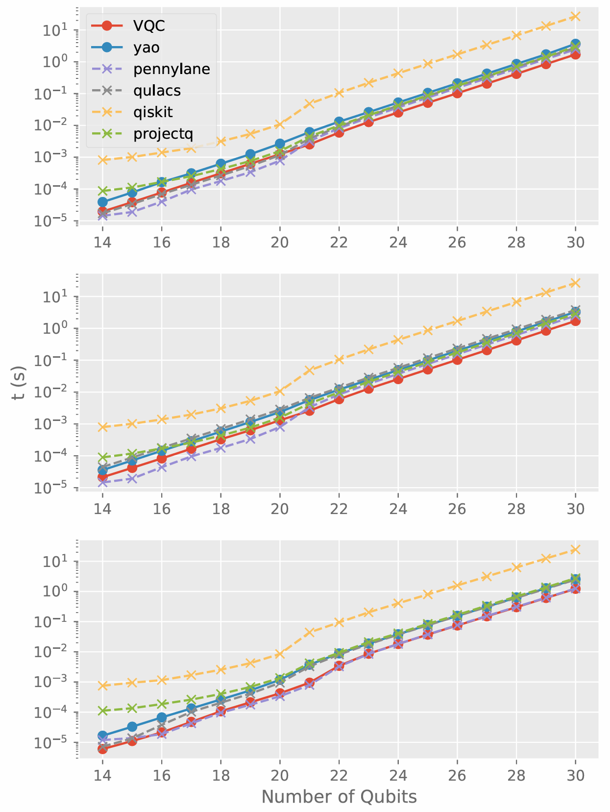
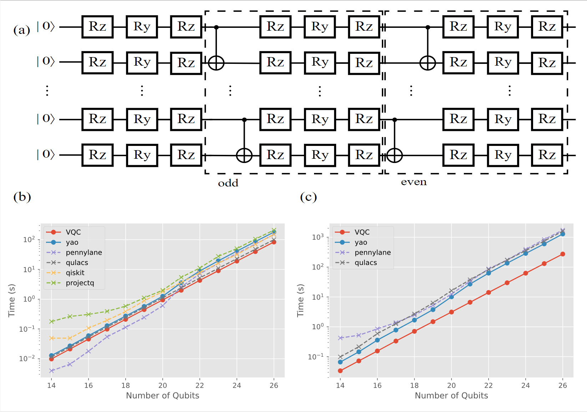
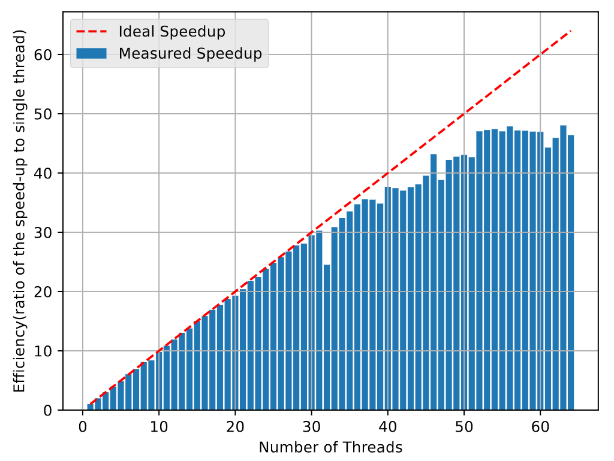
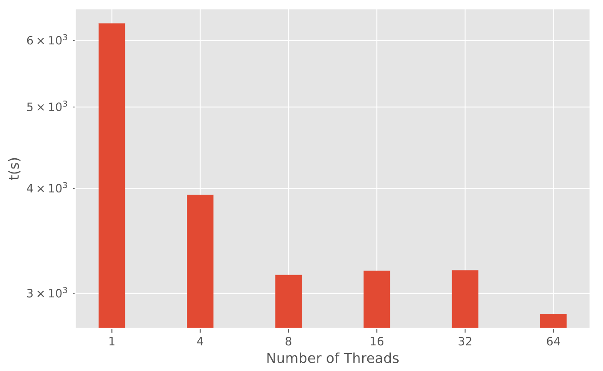

# **JuliVQC Benchmark** 


This repository presents the **benchmarking code and results** for **[JuliVQC.jl](https://github.com/weiyouLiao/JuliVQC.jl)**, a high-performance Julia library for **variational quantum circuit (VQC)** simulations. The benchmarks showcase **JuliVQC.jl**'s capabilities and compare its performance against other popular quantum circuit simulators.

---

## **Paper**

This work is detailed in the paper:

- **[JuliVQC: An Efficient Variational Quantum Circuit Simulator for Near-Term Quantum Algorithms](https://arxiv.org/abs/2406.19212)**  

  The paper provides a comprehensive explanation of the methodology, implementation, and applications of **JuliVQC.jl**.

---

## **Getting Started**

Follow these steps to set up the benchmark repository and run the benchmarks on your local machine.

### **Prerequisites**

Ensure you have the following software installed:

- **Python** (version 3.8 or later)
- **Julia** (version 1.6 or later)
- **pip** (Python package manager)

---

### **Installation**

1. Clone the benchmark repository:
   ```bash
   git clone https://github.com/weiyouLiao/JuliVQC-benchmark.git
   cd JuliVQC-benchmark
   ```

2. Set up a Python virtual environment to isolate dependencies:
   ```bash
   python -m venv .
   source ./bin/activate  # For Windows: benchmark-env\Scripts\activate
   ```

3. Install Python dependencies:
   ```bash
   pip install -r requirements.txt
   ```

4. To set up the Julia dependencies for the benchmark, follow these steps:
   
   - **Launch the Julia REPL**:
      Open your terminal and start Julia by typing:
   
      ```bash
      julia
      ```
   
   - **Activate the Benchmark Project Environment**:
      Inside the Julia REPL, activate the local environment for the benchmark repository:
   
      ```julia
      using Pkg
      Pkg.activate(".")
      ```
   
      This ensures that a dedicated environment is used for this project, isolating its dependencies.
   
   - **Install All Default Dependencies**:
      Install all required Julia packages listed in the `Project.toml` file of the benchmark repository (excluding `JuliVQC.jl` and its custom dependency):
   
      ```julia
      Pkg.instantiate()
      ```
   
   - **Install `QuantumCircuits.jl`**:
      Since **JuliVQC.jl** depends on a custom version of `QuantumCircuits.jl`, you need to install it manually from its  repository:
   
      ```julia
      Pkg.add(url="https://github.com/weiyouLiao/QuantumCircuits.jl")
      ```
   
   - **Install `JuliVQC.jl`**:
      Finally, install **JuliVQC.jl** from its  repository:
   
      ```julia
      Pkg.add(url="https://github.com/weiyouLiao/JuliVQC.jl")
      ```
   

---

### **Running the Benchmarks**

The benchmarks are organized into four main categories:

1. **Single Gate Operation Benchmarks**: Tests the performance of individual quantum gate operations.
2. **Quantum Circuit and Variational Quantum Circuit Benchmarks**: Evaluates the performance of various quantum circuits and gradient computations.
3. **VQC Parallelization Test**: Measures the parallelization efficiency of **JuliVQC.jl**.
4. **VQC Noisy Automatic Differentiation Test**: Assesses the performance of noisy automatic differentiation in quantum circuits.

To run all benchmarks, execute the following script:

```bash
./execute_all.sh
```

If the script is not executable, make it so using:
```bash
chmod +x execute_all.sh
```

Alternatively, you can navigate to specific benchmark folders and run them individually.

---

## **Dependencies**

The following libraries and tools are required for the benchmarks. The versions listed are those tested in our experiments:

| **Library/Tool**    | **Version** |
| ------------------- | ----------- |
| ProjectQ            | 0.8.0       |
| Qulacs              | 0.6.3       |
| Qiskit              | 0.45.3      |
| Qiskit-aer          | 0.13.2      |
| Pennylane           | 0.34.0      |
| Pennylane-lightning | 0.34.0      |
| Yao                 | 0.8.13      |
| pytest-benchmark    | 4.0.0       |
| MKL                 | 2024.0.0    |
| numpy               | 1.26.3      |

---

## **Benchmark Results**

### 1. **Single Gate Operation Benchmarks**



This test compares single-thread runtime performance for the following gates:
- **H Gate** (top)
- **Rx Gate** (middle)
- **CNOT Gate** (bottom)

---

### 2. **Quantum Circuit and Variational Quantum Circuit Benchmarks**



- **(a)** Structure of the random quantum circuit used for benchmarking. Gates within the dashed box represent one layer.
- **(b)** Runtime scaling for simulating random quantum circuits.
- **(c)** Runtime scaling for computing gradients of random quantum circuits, plotted against the number of qubits.

---

### 3. **VQC Parallelization Test**



This test evaluates the parallelization efficiency of **JuliVQC.jl**. The y-axis shows the speedup (acceleration ratio) of multi-threaded simulations compared to single-threaded versions.

---

### 4. **VQC Noisy Automatic Differentiation Test**



This benchmark examines **noisy automatic differentiation** using circuits with 14 qubits and a depolarizing noise channel applied after each layer.

---

## 🔗 **Additional Resources**

- **Main JuliVQC.jl Repository**: [https://github.com/weiyouLiao/JuliVQC.jl](https://github.com/weiyouLiao/JuliVQC.jl)  
  Explore the core library and its documentation.
